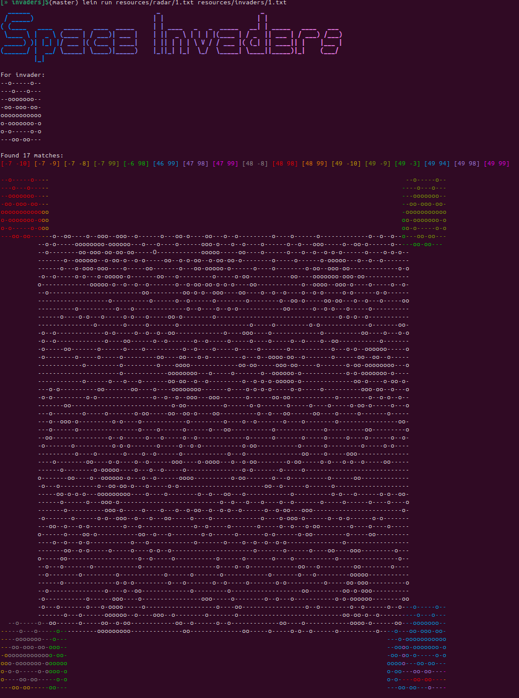

# invaders

A Clojure library designed to track down invaders.

## Usage

To see the invaders (or potential invaders), start a REPL with `lein repl` and run the function `(demo)`

To run it with specific file:
```bash
lein run path-to-radar path-to-invader
```

[bling](https://github.com/paintparty/bling) is used to bring some colors to the ascii

Example of execution:



## Code style

For naming I use the convention described in [Elements of Clojure by Zachary Tellman](https://elementsofclojure.com/). An excellent read if you don't know it yet.

In addition to that:

1. I used private function (`defn-`) for function that have no business being used outside of the current namespace. I still test this function with `'#` when it make sense. I find this convention useful for refactoring.

2. In my test file I use the alias `sut` for [System under test](https://en.wikipedia.org/wiki/System_under_test)

While I like these conventions, I'm not too attached to them either.

## Notes

I did not write it with performance or large radar in mind. Some thoughs on it:
- The current implementation is using brute force. For example using a sliding window would make it more efficient. I'm sure they many optimizations to this kind of 2D matching problem.
- Using native Java array (with `make-array`) will make it more memory efficient with the downside of loosing homoiconicity and having to use special function like `aget` and `aset`

I use [cursor](https://cursor.com/) to assist me.


## License

Copyright © 2025 Julien Bille
